# Implementation of Poisson Image Editing and Pix2Pix

This repository is Weilong Li's implementation of Assignment_02 of DIP.

## Requirements

### Task Possion Image Editing

```python
python -m pip install -r requirements.txt
```

### Task Pix2Pix

```powershell
cd ".\Pix2Pix"
uv venv
.venv\Scripts\activate
uv sync
```

## Running

### Task Possion Image Editing

```python
python run_blending_gradio.py
```

### Task Pix2Pix

运行脚本下载数据集

```bash
bash download_facades_dataset.sh
```

执行训练代码

```python
uv run python train.py
```


## Results

### Task Possion Image Editing

| 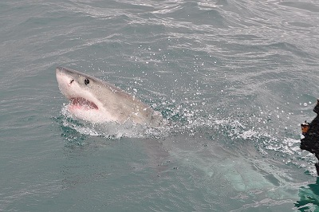 | 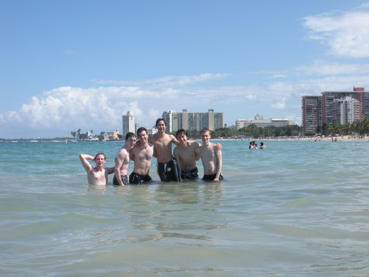 |
| -------------------------------------- | -------------------------------------- |

| 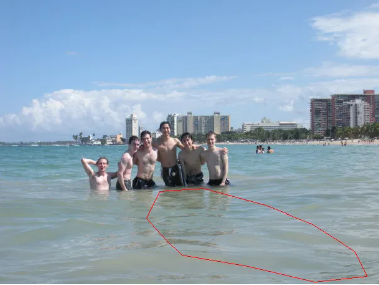 | 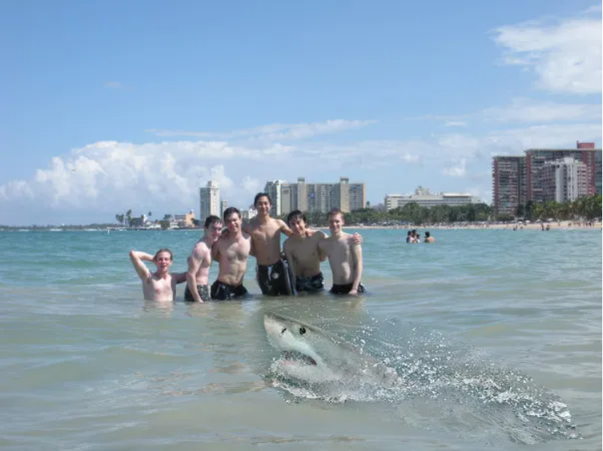 |
| ------------------------------------------------------------ | ------------------------------------------------------------ |

| .png)               | .png)               |
| ------------------------------------------------------------ | ------------------------------------------------------------ |
| 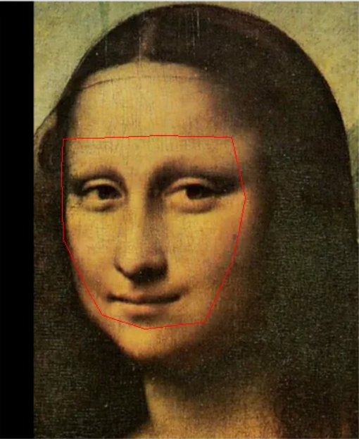 | 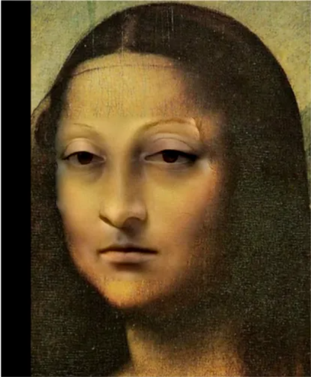 |

| 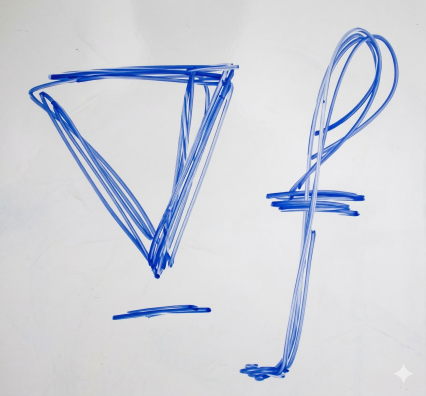 |  |
| ------------------------------------------------------------ | ------------------------------------------------------------ |

| 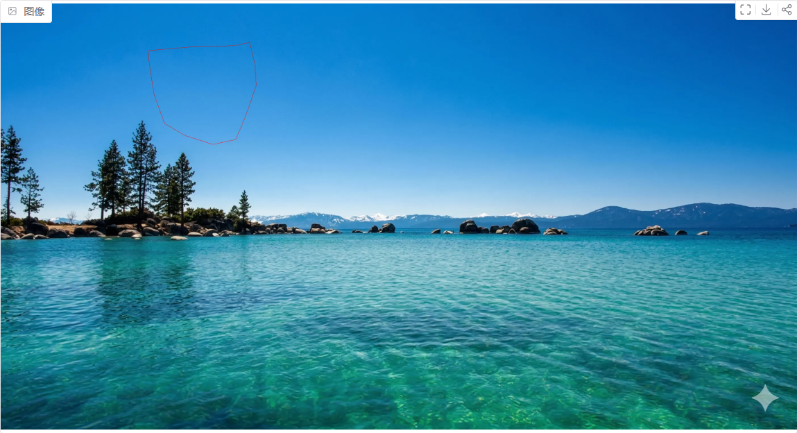 | 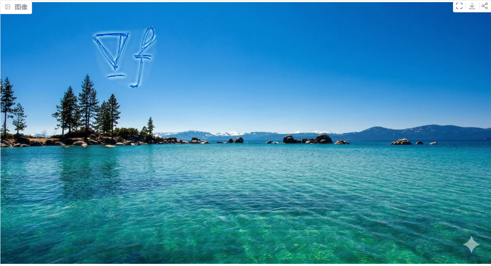 |
| ------------------------------------------------------------ | ------------------------------------------------------------ |


### Task Pix2Pix

#### Facades

| epoch=300 | train loss=0.233176 | val loss=0.400512 |
| --------- | ------------------- | ----------------- |

| 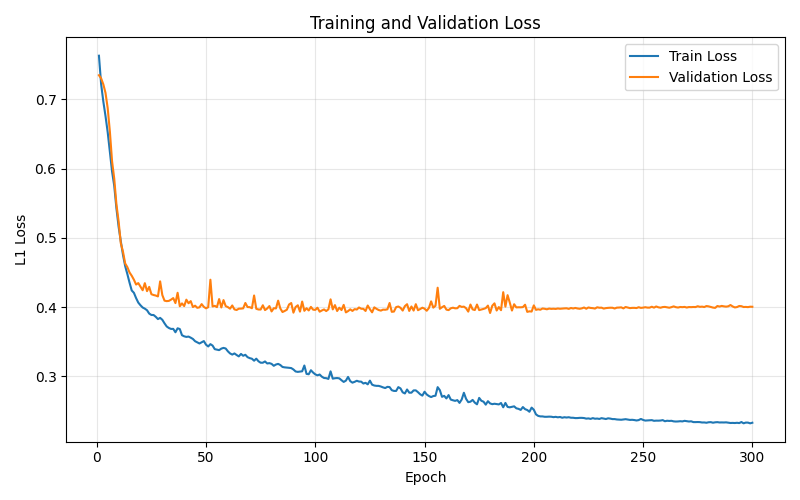 |
| ---------------------------------------------- |

训练300轮后验证集上的结果如下：

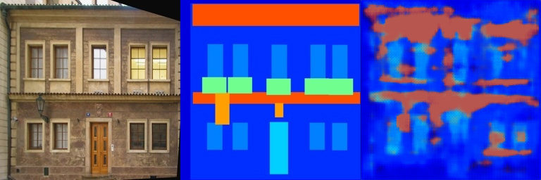

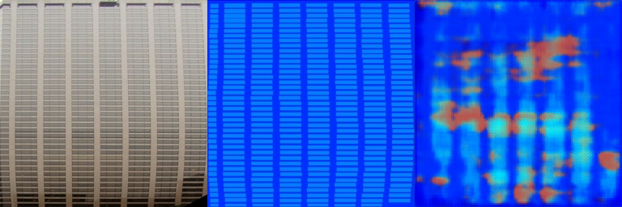

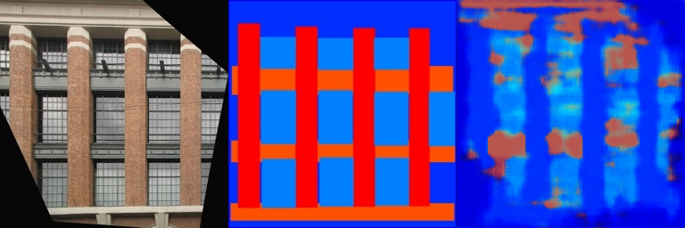

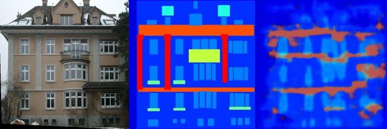

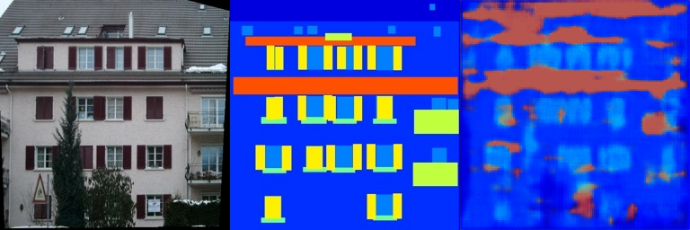

#### cityscapes

| epoch=300 | train loss=0.09794 | val loss=0.12090 |
| --------- | ------------------ | ---------------- |

| 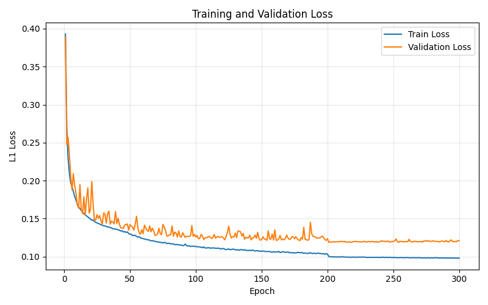 |
| ------------------------------------------------------------ |

训练300轮后验证集上的结果如下：

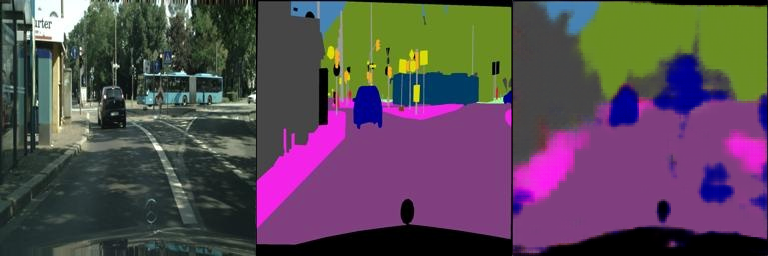

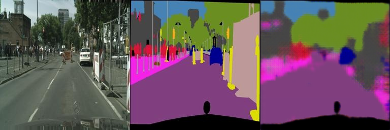

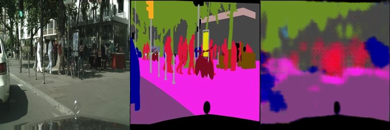

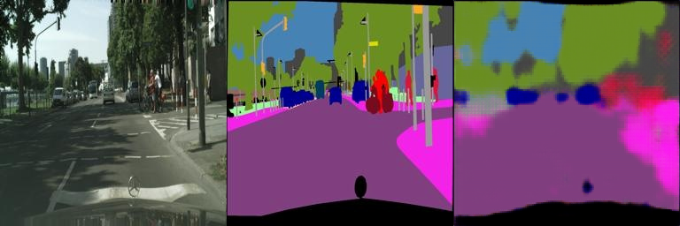

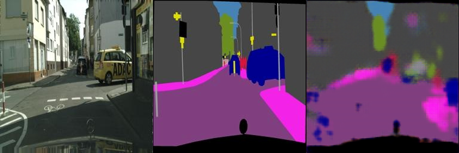