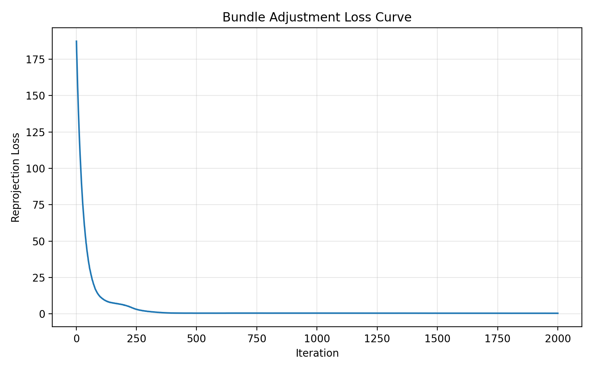
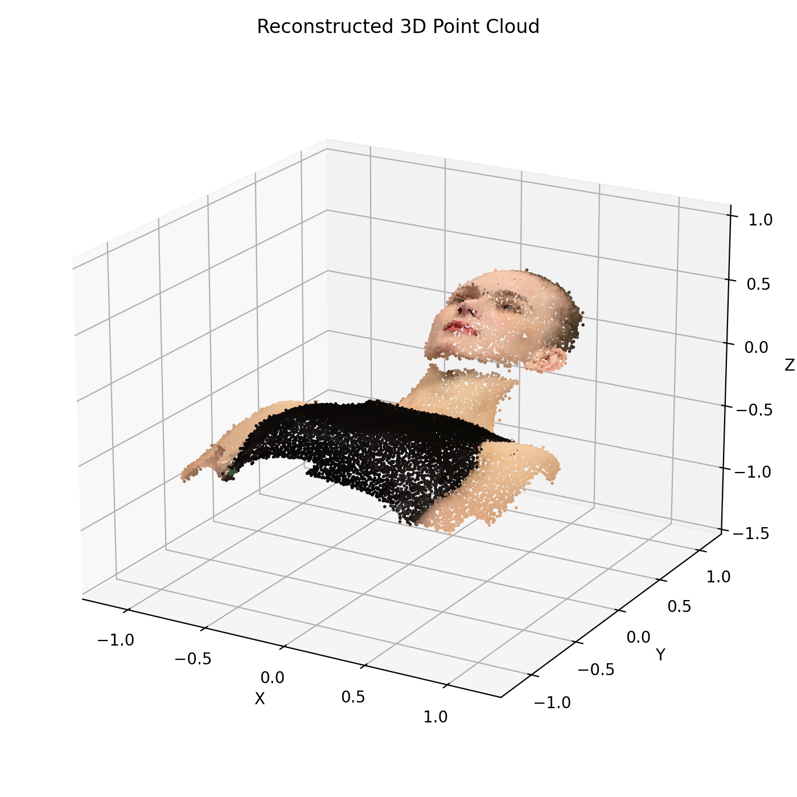
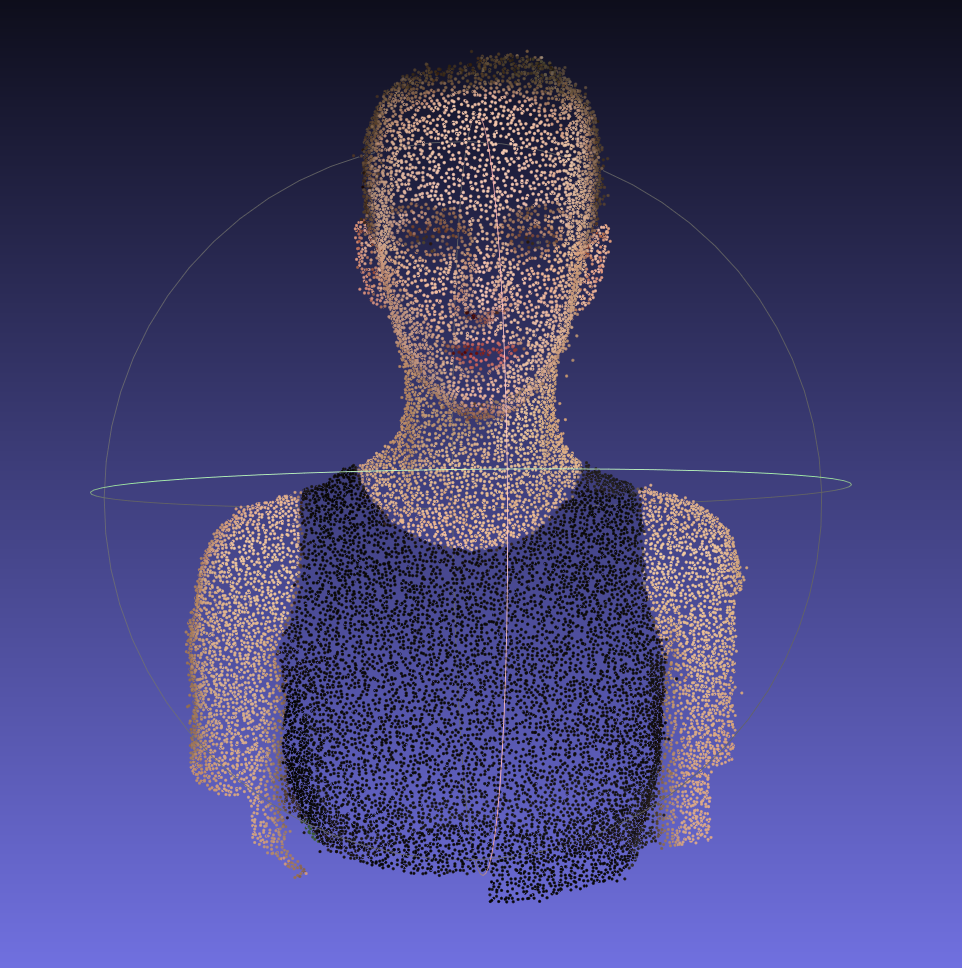
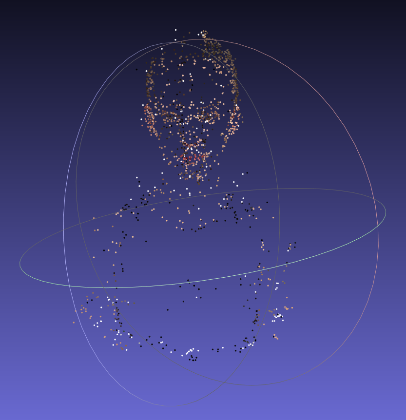
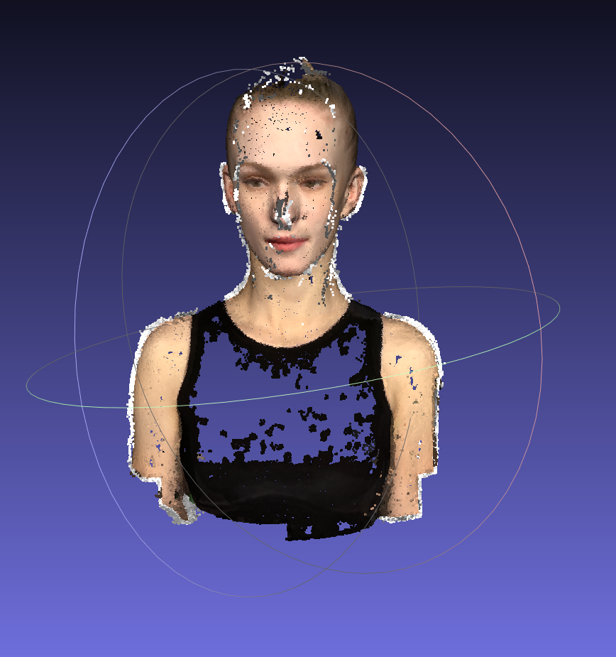
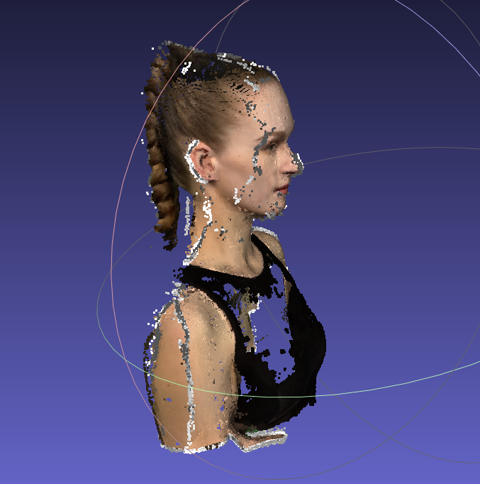

# Assignment 3  Bundle Adjustment 

This repository is Weilong Li's implementation of Assignment_03 of DIP.

- Task 1 ：基于PyTorch 实现Bundle Adjustment。给定多视角下的 2D 观测点，目标是联合优化相机外参、焦距以及 3D 点坐标，使重投影点尽可能接近真实 2D 观测。

- Task 2 ：使用 COLMAP 对给定的多视角图像进行完整的三维重建。整个流程包括特征提取、特征匹配、稀疏重建、稠密深度估计以及点云融合。

实验数据包含 50 张渲染视角图像、20,000 个 3D 点，以及这些 3D 点在不同视角下的 2D 观测。

## Requirements

本实验使用 `uv` 搭建和管理 Python 环境。

创建虚拟环境：

```bash
uv venv
```

激活虚拟环境：

```bash
.venv\Scripts\Activate.ps1
```

安装 Task 1 所需依赖：

```bash
uv pip install numpy torch matplotlib
```

Task 2 需要额外安装 COLMAP。COLMAP 需要单独安装，并加入系统 `PATH`，这样才能在命令行中直接调用。

检查 COLMAP 是否安装成功：

```bash
colmap -h
```

## Running

### Task 1

运行 PyTorch Bundle Adjustment 脚本：

```bash
uv run python task1_bundle_adjustment.py
```

也可以显式指定输入输出路径和训练参数：

```bash
uv run python task1_bundle_adjustment.py \
    --data-dir data \
    --output task1_result.obj \
    --loss-plot task1_loss_curve.png \
    --point-cloud-plot task1_point_cloud.png \
    --iters 2000 
    --batch-size 50000
```

预期输出文件包括：

```text
task1_result.obj
task1_loss_curve.png
task1_point_cloud.png
```

### Task 2

运行 COLMAP 重建脚本：

```bash
bash run_colmap.sh
```

预期输出文件包括：

```text
colmap_workspace/sparse/sparse.ply
colmap_workspace/dense/fused.ply
```

生成的点云文件可以使用 MeshLab工具进行可视化。

## Task 1

### Method

Task 1 的核心是用 PyTorch 实现 Bundle Adjustment，并通过梯度下降同时优化相机参数和 3D 点坐标。需要优化的变量包括：

- 3D point positions: `(X, Y, Z)`
- Camera extrinsics: 每个视角对应的 Euler angles 和 translations
- Camera focal length: 使用 `log_focal` 表示并优化

2D 观测数据从 `data/points2d.npz` 中读取。每个视角对应一个形状为 `(20000, 3)` 的数组，每一行表示：

```text
x, y, visibility
```

其中 `x` 和 `y` 是图像坐标，`visibility` 表示该点在当前视角下是否可见。优化时只使用可见点。为了便于 PyTorch 索引，所有可见观测会被整理成扁平数组：

```text
view_idx
point_idx
observed_xy
```

对于每一条可见观测，先取出对应的相机外参和 3D 点，并将 3D 点变换到相机坐标系：

```text
[Xc, Yc, Zc] = R @ [X, Y, Z]^T + T
```

然后将相机坐标投影到图像平面：

```text
u = -f * Xc / Zc + cx
v =  f * Yc / Zc + cy
```

其中主点坐标设置为图像中心：

```text
cx = image_width / 2
cy = image_height / 2
```

焦距根据初始视场角进行初始化：

```text
f = image_size / (2 * tan(fov / 2))
```

损失函数使用 Smooth L1 loss，用来衡量投影点和真实 2D 观测点之间的误差：

```text
loss = SmoothL1(projected_xy, observed_xy)
```

最后使用 Adam 优化器对 3D 点、相机外参和焦距进行联合优化。

### Results

本次优化使用的主要参数如下：

```text
views = 50
points = 20000
visible_observations = 805089
initial_focal = 886.810
iterations = 2000
```

训练过程中，重投影误差从第 1 轮的 `187.337509` 降低到第 2000 轮的 `0.381879`，说明优化后的 3D 点和相机参数能够较好地解释输入的 2D 观测。

最终结果如下：

```text
final_loss = 0.381879
final_focal = 863.126
iterations = 2000
```

### Loss Curve



### Reconstructed Point Cloud



导出的 OBJ 点云文件保存为：

```text
task1_result.obj
```




## Task 2: Method

Task 2 使用 COLMAP 从多视角图像中进行三维重建。输入图像位于：

```text
data/images/
```

COLMAP 的主要流程如下：

1. Feature extraction：对所有输入图像提取局部特征。
2. Feature matching：在不同图像之间匹配特征点，建立跨视角对应关系。
3. Sparse reconstruction：通过 Structure-from-Motion 估计相机位姿和稀疏 3D 点，同时 COLMAP 内部会执行 Bundle Adjustment 来优化相机和点云结构。
4. Image undistortion：将稀疏重建结果转换为适合稠密重建的格式。
5. Dense stereo matching：使用 PatchMatch Stereo 为各个视角估计深度图。
6. Stereo fusion：将多个视角的深度图融合为稠密点云。

本实验通过 `run_colmap.sh` 脚本自动执行上述流程。

## Task 2: Results

稀疏重建结果保存路径为：

```text
colmap_workspace/sparse/sparse.ply
```

稠密重建结果保存路径为：

```text
colmap_workspace/dense/fused.ply
```

稀疏重建可视化结果




稠密重建可视化结果




