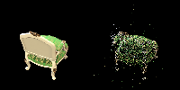
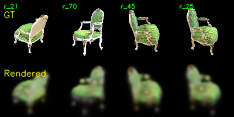
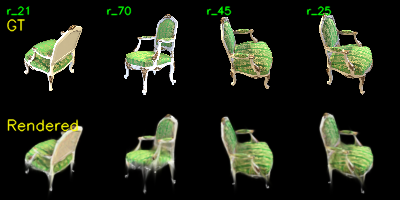
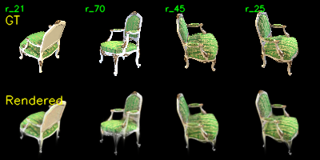
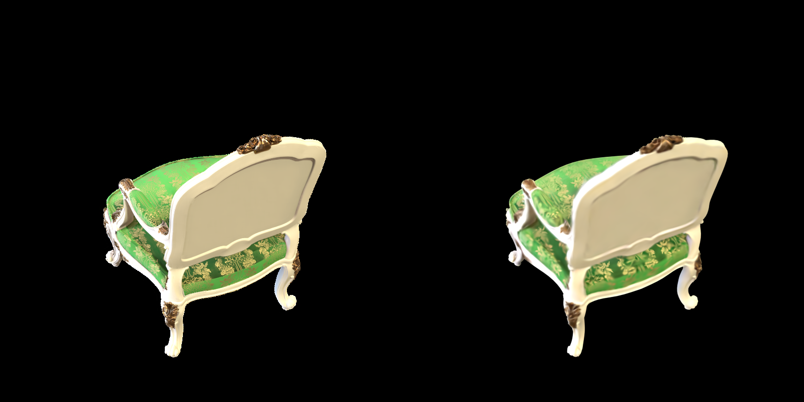
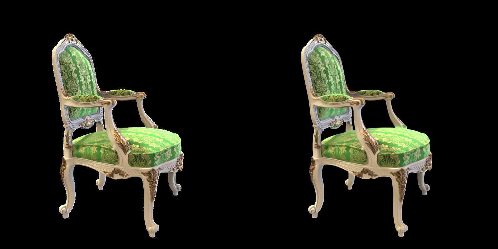
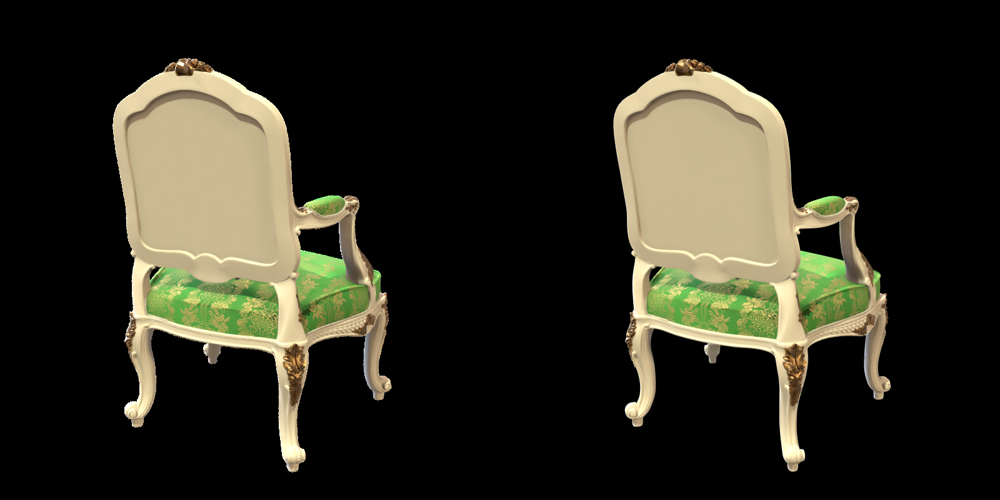
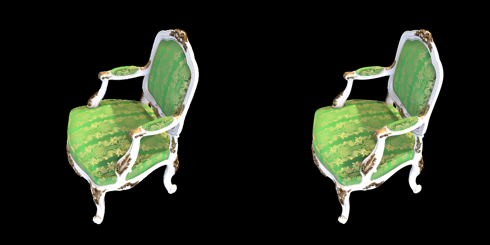

# Assignment4: 3D Gaussian Splatting 实验报告

## 1. 实验概述
This repository is Weilong Li's implementation of Assignment_04 of DIP.
本实验实现了一个简化版 3D Gaussian Splatting重建与渲染流程。整体流程分为三步：首先使用 COLMAP 从多视角图像中恢复相机内外参和稀疏三维点；然后以 COLMAP 点云为初始化，将每个三维点扩展为可优化的 3D Gaussian，并在 PyTorch 中实现投影、二维高斯计算和 alpha blending；最后与官方 3DGS 实现进行对比，分析渲染质量、训练速度和显存占用差异。

本次实验使用 `chair` 场景，共 100 张多视角图像，输入路径为 `data/chair/images/`。

## 2. 环境配置与运行方式

本项目使用 `uv` 管理 Python 环境。首先在项目根目录同步依赖：

```powershell
uv sync
```

完成 COLMAP 稀疏重建：

```powershell
uv run python mvs_with_colmap.py --data_dir data/chair
```

进行重投影验证：

```powershell
uv run python debug_mvs_by_projecting_pts.py --data_dir data/chair
```

简化版 3DGS 的训练命令如下。

```powershell
uv run python train.py --colmap_dir data/chair --checkpoint_dir data/chair/checkpoints_v2 
```

训练完成后，可以使用 checkpoint 渲染多视角视频：

```powershell
uv run python render_3dgs_mv.py --colmap_dir data/chair --checkpoint data/chair/checkpoints_v2/checkpoint_000180.pt --device cuda:2
```


## 3. Task 1：使用 COLMAP 恢复相机与稀疏点云

### 3.1 方法

Task 1 使用 COLMAP 完成 Structure-from-Motion。运行命令为：

```powershell
uv run python mvs_with_colmap.py --data_dir data/chair
```

脚本依次执行以下步骤：

1. `feature_extractor`：对 100 张输入图像提取 SIFT 特征；
2. `exhaustive_matcher`：对所有图像对进行穷举匹配；
3. `mapper`：根据匹配结果恢复相机位姿并三角化稀疏点云；
4. `model_converter`：将 COLMAP 二进制模型转换为文本格式，供后续 PyTorch 代码读取。


### 3.2 结果

COLMAP 输出目录为：

```text
data/chair/sparse/0/
data/chair/sparse/0_text/
```

其中后续训练使用的关键文件包括：

```text
data/chair/sparse/0_text/cameras.txt
data/chair/sparse/0_text/images.txt
data/chair/sparse/0_text/points3D.txt
```

本次重建结果中，COLMAP 生成了 1 个共享相机模型、100 张图像对应的位姿记录，以及 10390 个稀疏三维点。重投影验证命令为：

```powershell
uv run python debug_mvs_by_projecting_pts.py --data_dir data/chair
```

重投影结果示例如下，左侧为原图，右侧为恢复出的三维点重新投影到该视角后的结果：



可以看到，稀疏点大体落在椅子的坐垫、靠背、扶手和腿部区域，说明相机位姿与稀疏几何结构基本正确。右图中的点云较稀疏，且在纹理较弱或反光区域覆盖不足，这也是后续需要用 Gaussian 表示进行连续渲染优化的原因。

## 4. Task 2：简化版 3D Gaussian Splatting

### 4.1 Gaussian 参数化

每个三维高斯由位置、颜色、不透明度、旋转和尺度共同表示：

| 参数 | 初始化方式 |
| --- | --- |
| Position | COLMAP 稀疏点坐标 |
| Color | COLMAP 点颜色，映射到 `[0,1]` 后转为 logit 优化 |
| Opacity | 初始化为较高不透明度 |
| Rotation | 单位四元数初始化 |
| Scale | 根据近邻点距离初始化 |

协方差矩阵按照 3DGS 论文中的形式构造：

```text
Sigma = R S S^T R^T
```

其中 `R` 由四元数归一化后转换得到，`S` 为尺度向量构成的对角矩阵。

### 4.2 投影与二维高斯计算

三维点首先通过外参变换到相机坐标系，再通过内参投影到图像平面。二维协方差使用透视投影的一阶雅可比近似：

```text
Sigma_2D = J R_cam Sigma_3D R_cam^T J^T
```

二维高斯值按如下公式计算：

```text
f(x) = 1 / (2 pi sqrt(|Sigma|)) * exp(-1/2 (x - mu)^T Sigma^-1 (x - mu))
```

实现过程中曾出现训练初期 `loss=nan` 的问题。排查后发现主要原因是部分高斯点位于当前相机后方或深度接近 0，虽然最终会被 depth mask 排除，但在投影和协方差计算时仍可能产生 `inf` 或 `nan`。因此在实现中对无效深度使用安全深度参与中间计算，并仍通过原始深度进行有效性判断。同时，对二维协方差加入最小屏幕空间 footprint，并使用 2x2 矩阵的解析逆形式提升数值稳定性。

### 4.3 Alpha Blending

对所有高斯按深度从近到远排序后，逐像素计算：

```text
alpha_i = opacity_i * gaussian_i
T_i = product_{j<i}(1 - alpha_j)
weight_i = alpha_i * T_i
```

最终像素颜色为所有高斯颜色的加权和。为了避免数值不稳定，`alpha` 被限制在 `[0, 0.999]` 范围内。

### 4.4 训练设置

模型训练 200 个 epoch，batch size 为 1，使用 L1 loss：

```text
loss = mean(abs(rendered_image - gt_image))
```

优化器为 Adam，各参数组学习率如下：

| 参数 | 学习率 |
| --- | ---: |
| Position | 0.000016 |
| Color | 0.025 |
| Opacity | 0.05 |
| Scale | 0.005 |
| Rotation | 0.001 |

训练结果保存在：

```text
data/chair/checkpoints_v2/
```

训练过程中每个 epoch 保存 4 个固定视角的 GT 与渲染对比图。下列图片展示了不同 epoch 的渲染变化：








从不同 epoch 的对比可以看到，模型在初期已经能利用 COLMAP 初始化恢复出椅子的基本轮廓；随着训练推进，椅子坐垫、靠背和白色扶手逐渐变得稳定，颜色分布也更接近 GT。但从 100 epoch 之后，视觉改善趋于缓慢，最终结果仍存在明显模糊。最终结果能够恢复椅子的主体轮廓、绿色坐垫和白色边框等主要结构，并且多视角下的姿态基本一致；但金色纹理较模糊，椅腿和边缘存在拖影，整体呈现低通滤波后的效果。这与本实验实现的简化程度直接相关。

训练完成后还生成了一个沿训练相机路径的渲染视频：

```text
data/chair/checkpoints_v2/debug_rendering.mp4
```

## 5. Task 3：与官方 3DGS 实现对比

### 5.1 官方实现训练设置与运行结果

官方 3DGS 使用相同的 `chair` 场景训练。训练命令如下：

```powershell
cd gaussian-splatting
python train.py -s data/chair -m output/chair_official --snapshot_interval 1000
```

其中 `--snapshot_interval 1000` 用于每 1000 次迭代保存一次 GT 与渲染对比图，并记录训练统计。模型配置保存在：

```text
gaussian-splatting/output/chair_official/cfg_args
```

输出目录为：

```text
gaussian-splatting/output/chair_official/
```

训练快照保存在：

```text
gaussian-splatting/output/chair_official/train_snapshots/
```

不同迭代次数的训练快照如下，图片左侧为 GT，右侧为官方 3DGS 渲染：









可以看到，官方实现早期已经能够恢复出较清晰的椅子主体；随着 densification 持续增加高斯数量，坐垫纹理、白色框架和金色装饰逐渐变得清晰。最终 30000 次迭代时，官方实现对椅子的边缘、坐垫纹理、白色框架和金色装饰都能较好重建，渲染结果与 GT 非常接近。相比之下，简化版虽然能生成正确的大体结构，但高频纹理和边缘清晰度明显不足。

### 5.2 定量与运行表现对比

每 1000 次迭代记录一次训练速度、峰值显存和高斯数量。部分迭代统计如下：

| Iteration | Iter time | Throughput | Peak VRAM | Gaussian count |
| ---: | ---: | ---: | ---: | ---: |
| 1000 | 35.93 ms | 27.83 it/s | 1125.60 MB | 22332 |
| 7000 |  34.28 ms | 29.18 it/s | 1546.26 MB | 274386 |
| 15000 |  14.68 ms | 68.11 it/s | 1693.99 MB | 363464 |
| 30000 |  13.50 ms | 74.08 it/s | 1693.99 MB | 363464 |

整体汇总结果如下：

| 方法 | 训练规模 | 最终高斯数量 | 平均单次迭代耗时 | 平均吞吐 | 峰值显存 |
| --- | ---: | ---: | ---: | ---: | ---: |
| 简化实现 | 200 epochs，100 views | 10390 | 约 0.75-0.80 s / step | 约 1.3 it/s | / |
| 官方实现 | 30000 iterations | 363464 | 29.41 ms / iter | 47.17 it/s | 1693.99 MB |

简化实现固定使用 COLMAP 的 10390 个稀疏点作为高斯数量，没有实现 densification，因此高斯数量始终远少于官方实现。官方实现最终高斯数量达到 363464，是简化实现的约 35 倍，但由于使用 CUDA rasterizer、tile-based rasterization 和更完善的数据结构，训练速度反而显著更快。

### 5.3 差异分析

渲染质量方面，官方实现明显优于简化版。主要原因包括：

1. 官方实现支持 adaptive densification，会在训练过程中根据梯度和误差不断增殖高斯点，使模型能够覆盖更多几何细节和纹理区域；简化版高斯数量固定，受 COLMAP 稀疏点数量限制。
2. 官方实现使用球谐函数表示视角相关颜色，能够更好处理高光和视角变化；简化版只优化固定 RGB 颜色，表达能力较弱。
3. 官方实现使用高效 CUDA rasterizer 和 tile-based rendering，只处理对像素有贡献的高斯；简化版在 PyTorch 中对大量高斯和像素做直接张量计算，速度慢、显存利用效率低。
4. 官方实现包含更完整的优化策略，如 opacity reset、densification interval、pruning、学习率调度等；简化版只使用固定参数组学习率和 L1 loss，优化能力有限。

训练速度方面，简化版每张图像渲染约需 0.75-0.80 秒，而官方实现平均每次迭代约 29.41 毫秒。虽然两者迭代定义不完全相同，但速度差距仍非常明显。根本原因是简化版没有定制 rasterizer，也没有 tile culling，所有像素上的 Gaussian 计算都由通用 PyTorch 张量操作完成。


## 6. 结论

本实验完成了从 COLMAP 稀疏重建到简化版 3D Gaussian Splatting 训练与渲染的完整流程。COLMAP 能够为 `chair` 场景恢复有效的相机位姿和 10390 个稀疏点，为 Gaussian 初始化提供了可靠基础。简化版 3DGS 实现了协方差构造、透视投影、二维高斯计算和 alpha blending，并在训练后恢复出椅子的主要形状和颜色分布。

实验结果表明，简化版实现有助于理解 3DGS 的核心数学流程，但在实际重建质量和训练效率上与官方实现差距较大。官方实现通过 CUDA rasterizer、tile-based 渲染、自适应高斯增殖和更成熟的优化策略，在保持较低显存占用的同时实现了更高质量和更快速度。简化实现的主要局限是高斯数量固定、颜色模型简单、缺少 densification/pruning，以及使用通用 PyTorch 进行逐像素渲染导致效率较低。

总体而言，本实验验证了 3DGS 的基本思想：将稀疏三维点扩展为可优化的连续高斯表示，并通过可微投影与 alpha blending 从多视角图像中学习场景表示。后续若继续改进，可以重点加入 adaptive densification、球谐颜色、tile-based rasterizer 和更完整的训练调度策略。
